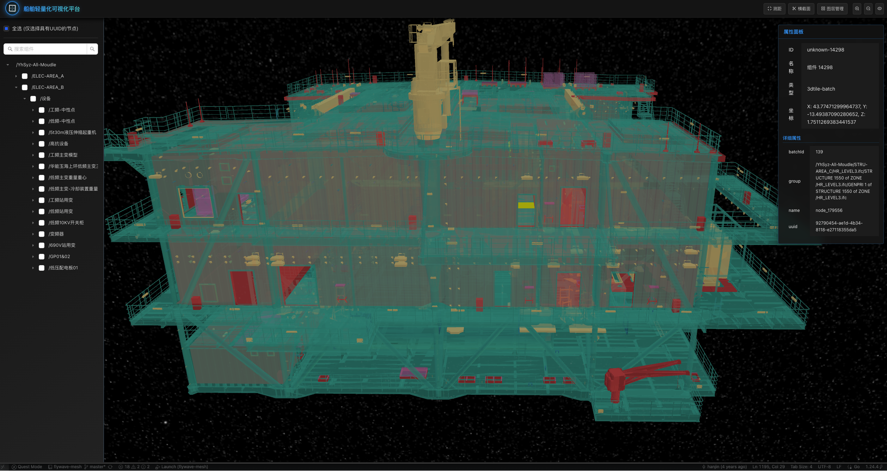
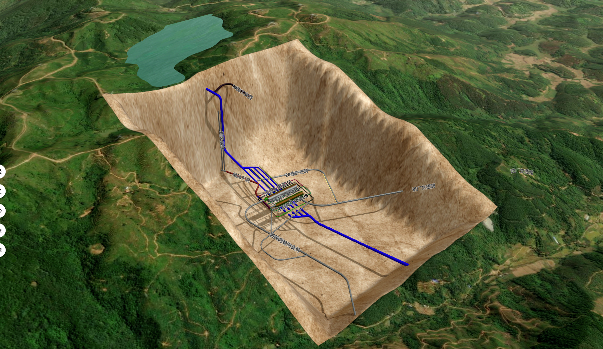
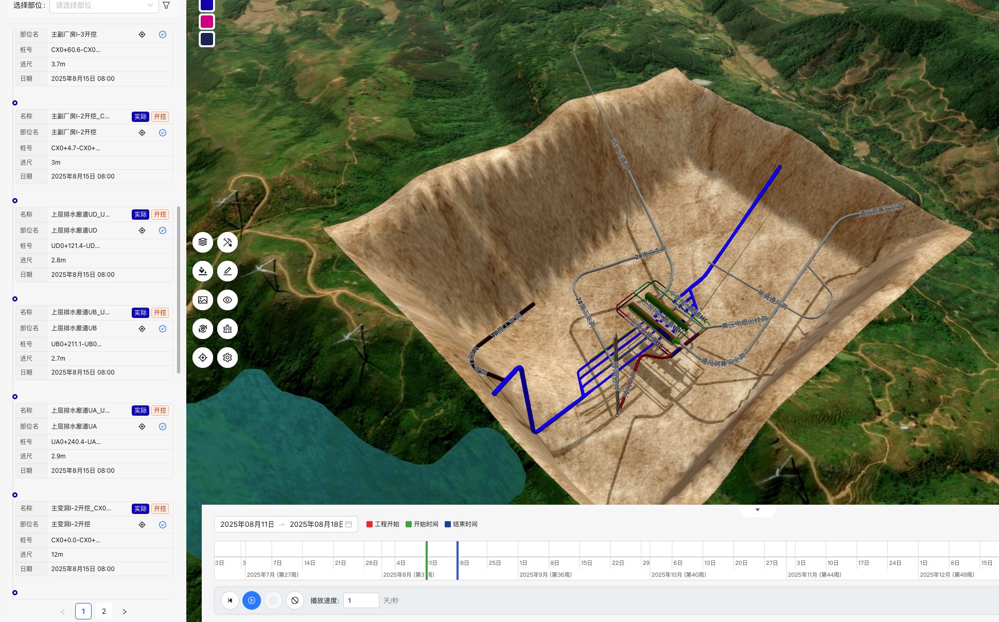

<!-- markdownlint-disable MD033 MD041 -->
<div align="center">

# 🌍 Flywave.gl

[](https://github.com/flywave/flywave.gl/actions/workflows/ci.yaml)
[](https://codecov.io/gh/flywave/flywave.gl)
[](./LICENSE)
[](https://www.npmjs.com/package/@flywave/flywave-mapview)
[](https://twitter.com/intent/tweet?text=Check%20out%20flywave.gl%20-%20an%20awesome%203D%20map%20engine!)

**An open-source 3D map rendering engine built with TypeScript**

_Creating high-performance, scalable 3D map visualization solutions using WebGL and Three.js_

[:cn: 中文版本](./README.zh.md) • 
[📚 Documentation](https://flywave.github.io/flywave.gl/docs) • 
[🎯 Examples](https://flywave.github.io/flywave.gl/examples) 
<!--•  [🏠 Website](https://flywave.net) -->

</div>

<br>

## 🌟 Overview

`flywave.gl` is an open-source 3D map rendering engine built with TypeScript. This project adopts a modular monorepo architecture, aiming to provide a high-performance, scalable, and modular 3D map rendering solution.

### 🔧 Key Capabilities

- 🌍 **Visually Appealing 3D Maps** - Create immersive map experiences using WebGL technology
- 🎨 **Dynamic Visualizations** - Based on the popular [three.js](https://threejs.org/) library
- 🎨 **Thematic Maps** - Supports multiple map styles and themes with dynamic switching
- ⚡ **High-performance Rendering** - Parallelizing CPU-intensive tasks with Web Workers
- 🔧 **Modular Design** - Modules and data providers can be swapped as needed

<br>

## 📸 Showcase

<div align="center">

|  |  |  |
|:---:|:---:|:---:|
|  |  |  |

|  |  |  |
|:---:|:---:|:---:|
|  |  |  |

|  |  |  |
|:---:|:---:|:---:|
|  |  |  |

|  |  |  |
|:---:|:---:|:---:|
|  |  |  |

</div>

<br>

## 🚀 Getting Started

### 📋 Prerequisites

| Tool | Version | Check Command |
|------|---------|---------------|
| **Node.js** | >= 22.15.0 | `node --version` |
| **pnpm** | >= 9.0.0 | `pnpm --version` |

### 🛠️ Installation

There are two ways to install flywave.gl:

#### Direct npm Installation (Recommended for projects)

```bash
# Using npm
npm install @flywave/flywave.gl

# Using pnpm (recommended)
pnpm add @flywave/flywave.gl
```

#### From Source (For development)

```bash
# Clone repository
git clone https://github.com/flywave/flywave.gl.git
cd flywave.gl

# Install dependencies
pnpm install

# Start development server
pnpm start
# Visit: http://localhost:8080/
```

### 📦 Building for Production


<br>

## 🎯 Core Features

- 🚀 **High-performance Rendering**: Achieve smooth 3D map rendering using WebGL and modern graphics technology
- 🔧 **Modular Design**: Select and combine different functional modules as needed
- 🎨 **Extensible Themes**: Support dynamic switching and customizing map themes
- 🗺️ **Multi-data Source Support**: Support various map data source formats
- 🖱️ **Rich Interactive Features**: Provide complete map interaction and control functions
- 🌍 **Multiple Projection Methods**: Support spherical, planar, and ellipsoid projections
- 🏔️ **Terrain Support**: Built-in Digital Elevation Model (DEM) support

<br>

## 💡 Usage Examples

### Basic Map with Data Source

```typescript
import { 
    MapView, 
    GeoCoordinates, 
    MapControls, 
    sphereProjection,
    ArcGISWebTileDataSource 
} from "@flywave/flywave.gl";

// Initialize map view
const mapView = new MapView({
    projection: sphereProjection,
    target: new GeoCoordinates(39.9042, 116.4074), // Beijing coordinates
    zoomLevel: 10,
    canvas: document.getElementById("mapCanvas")
});

// Create data source
const webTileDataSource = new ArcGISWebTileDataSource();

// Add data source to map
mapView.addDataSource(webTileDataSource);

// Add controls for user interaction
const mapControls = new MapControls(mapView);
```

<br>

## 📚 Resources

| Resource | Description | Link |
|---------|-------------|------|
| 📖 **Documentation** | API docs, tutorials, best practices | [flywave.github.io/flywave.gl/docs](https://flywave.github.io/flywave.gl/docs) |
| 🎯 **Examples** | Functional examples, code snippets | [flywave.github.io/flywave.gl/examples](https://flywave.github.io/flywave.gl/examples) |
| 🏠 **Website** | Project homepage, latest news | [flywave.github.io/flywave.gl](https://flywave.github.io/flywave.gl) |
| 🐛 **Issues** | Bug reports, feature suggestions | [GitHub Issues](https://github.com/flywave/flywave.gl/issues) |
| 💬 **Discussions** | Technical exchanges, usage help | [GitHub Discussions](https://github.com/flywave/flywave.gl/discussions) |

<br>

## 🤝 Contributing

We welcome contributions from the community! Please read our [Contributing Guide](./CONTRIBUTING.md) ([中文版](./CONTRIBUTING.zh.md)) to get started.

- Fork the repository
- Create a feature branch
- Commit your changes
- Push to the branch
- Open a pull request

<br>

## 📄 License

Copyright © 2022-2025 [Flywave Project Authors](https://github.com/flywave)

Licensed under the [Apache License, Version 2.0](./LICENSE).

<br>

<div align="center">

**Made with ❤️ by the Flywave Community**

[](https://github.com/flywave/flywave.gl)
[](https://github.com/flywave/flywave.gl)

</div>