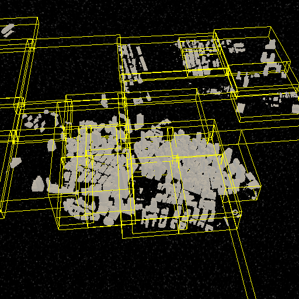
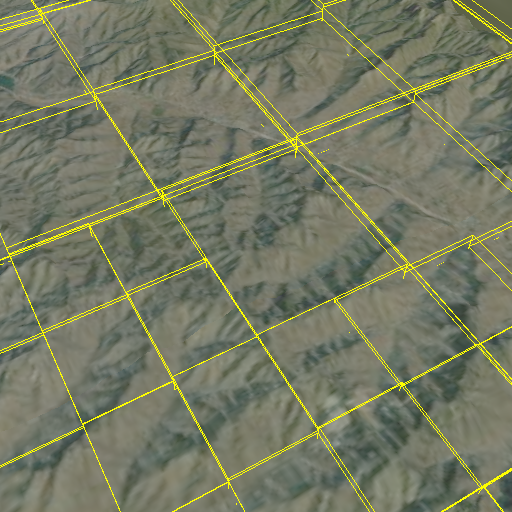
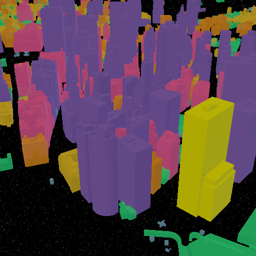
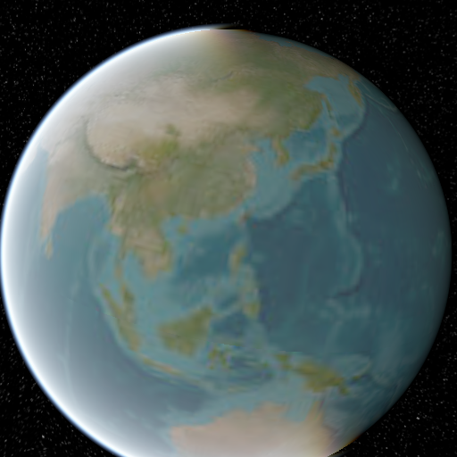
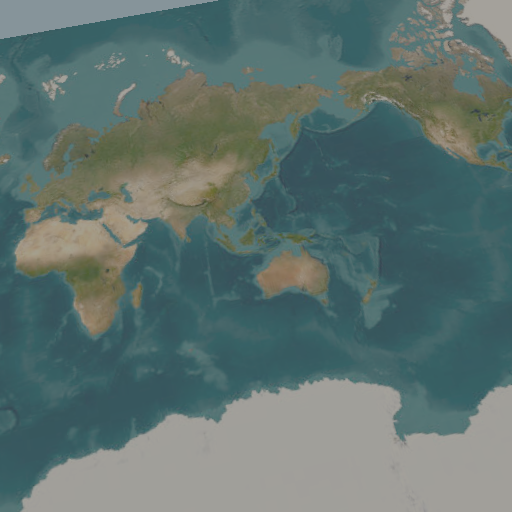
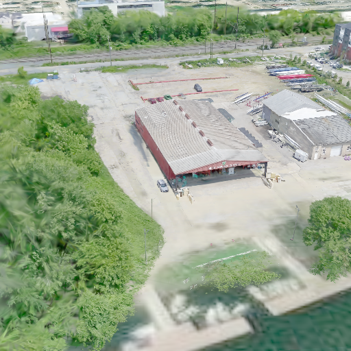
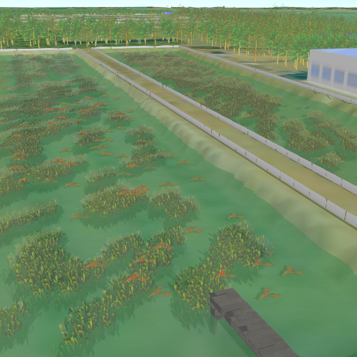
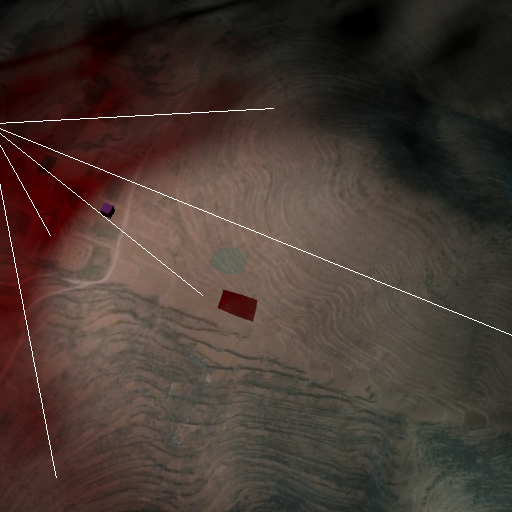
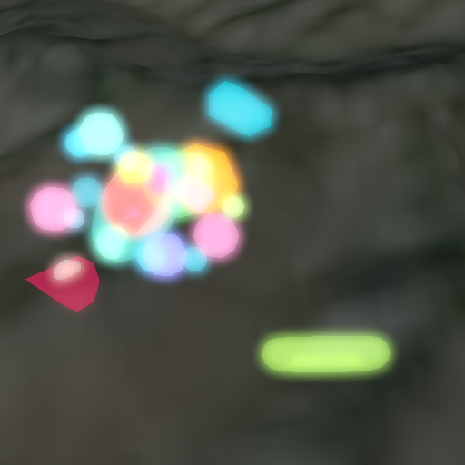

<!-- markdownlint-disable MD033 MD041 -->
<div align="center">

# 🌍 Flywave.gl

[](https://github.com/flywave/flywave.gl/actions/workflows/ci.yaml)
[](https://codecov.io/gh/flywave/flywave.gl)
[](./LICENSE)
[](https://www.npmjs.com/package/@flywave/flywave-mapview)
[](https://twitter.com/intent/tweet?text=Check%20out%20flywave.gl%20-%20an%20awesome%203D%20map%20engine!)

**一个基于 TypeScript 构建的开源 3D 地图渲染引擎**

_使用 WebGL 和 Three.js 创建高性能、可扩展的 3D 地图可视化解决方案_

[:us: English Version](./README.md) • 
[📚 官方文档](https://flywave.github.io/flywave.gl/docs) • 
[🎯 示例代码](https://flywave.github.io/flywave.gl/examples) 
<!--•  [🏠 官网](https://flywave.net) -->

</div>

<br>

## 🌟 项目简介

`flywave.gl` 是一个基于 TypeScript 构建的开源 3D 地图渲染引擎。该项目采用模块化 monorepo 架构，旨在提供一个高性能、可扩展且模块化的 3D 地图渲染解决方案。

### 🔧 核心能力

- 🌍 **视觉吸引力的 3D 地图** - 利用 WebGL 技术创建沉浸式地图体验
- 🎨 **动态可视化效果** - 基于流行的 [three.js](https://threejs.org/) 库
- 🎨 **主题地图** - 支持多种地图样式和主题的动态切换
- ⚡ **高性能渲染** - 使用 Web Workers 并行化 CPU 密集型任务
- 🔧 **模块化设计** - 可根据需要交换模块和数据提供者

<br>

## 📸 功能展示

<div align="center">

|  |  |  |
|:---:|:---:|:---:|
|  |  |  |

|  |  |  |
|:---:|:---:|:---:|
|  |  |  |

|  |  |  |
|:---:|:---:|:---:|
|  |  |  |

</div>

<br>

## 🚀 快速开始

### 📋 环境要求

| 工具 | 版本 | 检查命令 |
|------|------|----------|
| **Node.js** | >= 22.15.0 | `node --version` |
| **pnpm** | >= 9.0.0 | `pnpm --version` |

### 🛠️ 安装步骤

有两种方式安装 flywave.gl：

#### 直接使用 npm 安装（推荐用于项目）

```bash
# 使用 npm
npm install @flywave/flywave.gl

# 使用 pnpm（推荐）
pnpm add @flywave/flywave.gl
```

#### 从源码安装（用于开发）

```bash
# 克隆仓库
git clone https://github.com/flywave/flywave.gl.git
cd flywave.gl

# 安装依赖
pnpm install

# 启动开发服务器
pnpm start
# 访问：http://localhost:8080/
```

### 📦 生产环境构建


<br>

## 🎯 核心功能

- 🚀 **高性能渲染**：利用 WebGL 和现代图形技术实现流畅的 3D 地图渲染
- 🔧 **模块化设计**：可以根据需要选择和组合不同的功能模块
- 🎨 **可扩展主题**：支持动态切换和自定义地图主题
- 🗺️ **多数据源支持**：支持多种地图数据源格式
- 🖱️ **丰富的交互功能**：提供完整的地图交互和控制功能
- 🌍 **多种投影方式**：支持球面、平面和椭球投影
- 🏔️ **地形支持**：内置数字高程模型 (DEM) 支持

<br>

## 💡 使用示例

### 带数据源的基础地图

```typescript
import { 
    MapView, 
    GeoCoordinates, 
    MapControls, 
    sphereProjection,
    ArcGISWebTileDataSource 
} from "@flywave/flywave.gl";

// 初始化地图视图
const mapView = new MapView({
    projection: sphereProjection,
    target: new GeoCoordinates(39.9042, 116.4074), // 北京坐标
    zoomLevel: 10,
    canvas: document.getElementById("mapCanvas")
});

// 创建数据源
const webTileDataSource = new ArcGISWebTileDataSource();

// 添加数据源到地图
mapView.addDataSource(webTileDataSource);

// 添加控制以支持用户交互
const mapControls = new MapControls(mapView);
```

<br>

## 📚 资源链接

| 资源 | 描述 | 链接 |
|------|------|------|
| 📖 **官方文档** | API 文档、教程、最佳实践 | [flywave.github.io/flywave.gl/docs](https://flywave.github.io/flywave.gl/docs) |
| 🎯 **示例代码** | 功能示例、代码片段 | [flywave.github.io/flywave.gl/examples](https://flywave.github.io/flywave.gl/examples) |
| 🏠 **官网** | 项目主页、最新动态 | [flywave.github.io/flywave.gl](https://flywave.github.io/flywave.gl) |
| 🐛 **问题反馈** | Bug 报告、功能建议 | [GitHub Issues](https://github.com/flywave/flywave.gl/issues) |
| 💬 **社区讨论** | 技术交流、使用帮助 | [GitHub Discussions](https://github.com/flywave/flywave.gl/discussions) |

<br>

## 🤝 贡献指南

我们欢迎来自社区的贡献！请阅读我们的 [贡献指南](./CONTRIBUTING.zh.md) ([English Version](./CONTRIBUTING.md)) 开始参与。

- Fork 仓库
- 创建功能分支
- 提交更改
- 推送到分支
- 发起拉取请求

<br>

## 📄 许可证

版权所有 © 2022-2025 [Flywave 项目作者](https://github.com/flywave)

基于 [Apache 许可证 2.0 版](./LICENSE) 授权。

<br>

<div align="center">

**由 Flywave 社区用心制作**

[](https://github.com/flywave/flywave.gl)
[](https://github.com/flywave/flywave.gl)

</div>